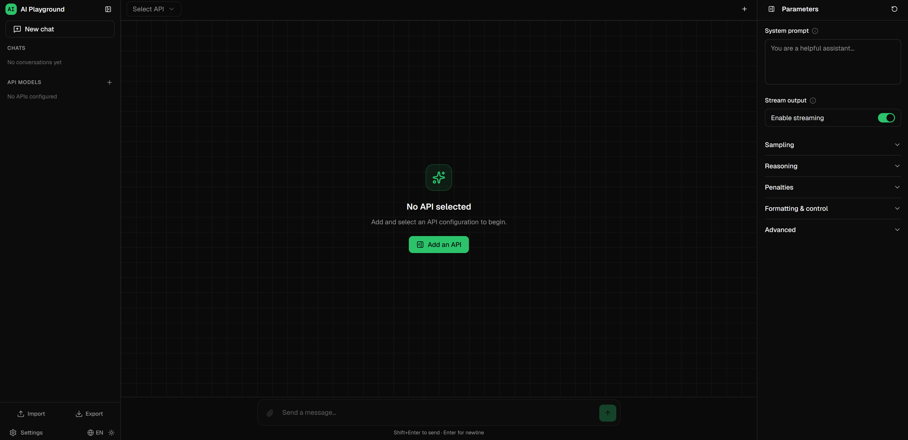
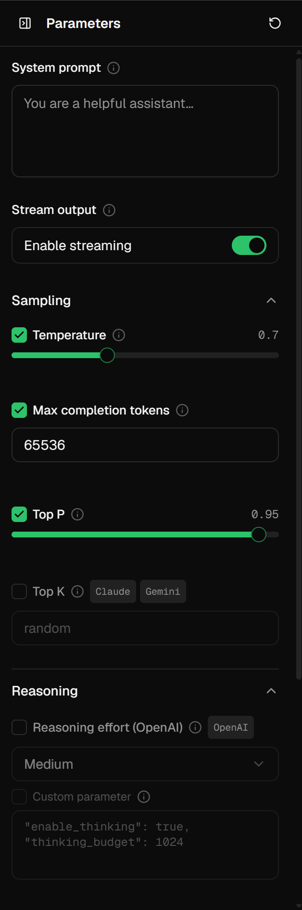
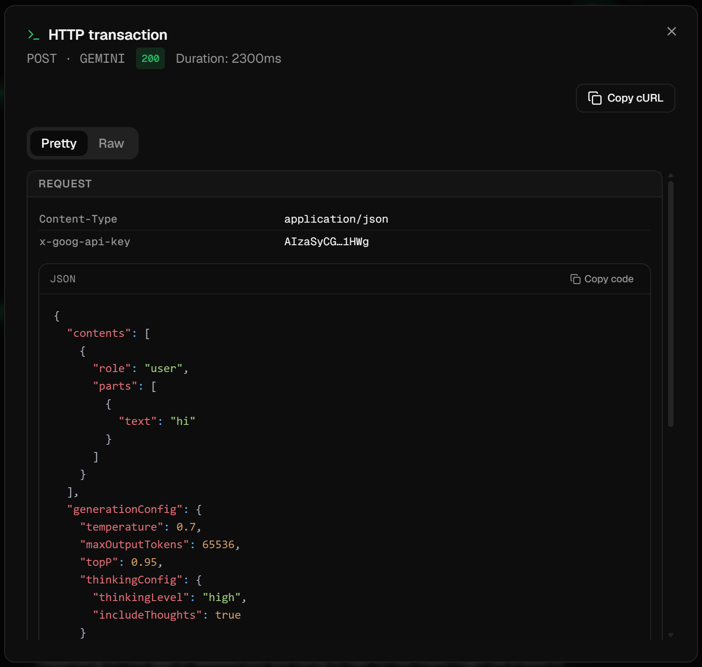

# AI Playground

A browser-only, multi-provider AI chat playground. It talks **directly from your browser** to OpenAI-compatible, Anthropic (Claude), and Google (Gemini) chat APIs — there is no backend. Your API keys, chat history, and settings never leave your machine: everything lives in your browser's `localStorage` and `IndexedDB`. Every request is captured so you can inspect it and re-export it as a ready-to-run `curl` command.

> No server. No telemetry. No sign-up. Bring your own API key and start chatting.

## Screenshots

> These images are placeholders. Drop your own captures into `docs/screenshots/` (see the note in that folder) and they will render here.

| Chat | Parameters | HTTP Inspector |
| --- | --- | --- |
|  |  |  |

## Features

- **Multi-provider** — OpenAI-compatible (OpenAI, DeepSeek, Ollama, vLLM, …), Anthropic **Claude**, and Google **Gemini**, switchable per chat.
- **Streaming** — token-by-token SSE rendering with a stop button; or single-shot non-streaming responses.
- **Reasoning / thinking display** — OpenAI `reasoning_effort`, Gemini thinking levels, and Claude extended thinking are surfaced in a collapsible block. Models that inline `<think>…</think>` in their output are handled too.
- **Full parameter tuning** — temperature, top_p, top_k, max tokens, penalties, stop sequences, seed, response format, `n`, logit bias, and more — each with a per-parameter **enable toggle** so you send only what you mean to.
- **Multimodal attachments** — images, audio, video, PDFs, and text/code files (drag-and-drop), encoded and sent in each provider's native format.
- **HTTP inspector + cURL export** — every request/response is captured (headers, body, status, timing) and can be copied as a `curl` command for the terminal.
- **CORS proxy fallback** — automatically retries through a user-configured proxy when a direct browser request is blocked by CORS.
- **Session management** — multiple conversations, auto-titling, rename, delete, regenerate.
- **Backup & restore** — export/import everything, configs-only, or chats-only as a JSON file.
- **Dark / light theme** and **English / 中文** UI.
- **100% client-side persistence** — nothing is uploaded anywhere except the provider you chose.

## How it works

The app is a static single-page application. When you send a message, your browser builds the provider-specific request and `fetch()`es the provider's API directly. Responses stream back over SSE and render live. Persistence is split:

- **`localStorage`** — API configs, model parameters, and settings (small, synchronous).
- **`IndexedDB`** (via [localforage](https://github.com/localForage/localForage)) — chat sessions, which can be large because they embed base64 media/PDF attachments.

Because there is no backend, **your API keys are only ever sent to the provider's endpoint** (or, if you enable it, your configured CORS proxy). See [`docs/ARCHITECTURE.md`](docs/ARCHITECTURE.md) for the full technical design.

## Quick start

**Prerequisites:** [Node.js](https://nodejs.org) 20.19+ (required by Vite 8) and npm.

```bash
npm install        # install dependencies
npm run dev        # start the dev server → http://localhost:51800
```

Open http://localhost:51800, click to add an API config, paste your key, and start chatting.

> There is **no `.env` file and no build-time configuration** — API keys are entered in the UI at runtime and stored in your browser.

### Other scripts

```bash
npm run build      # tsc -b (typecheck) then vite build → dist/
npm run preview    # serve the production build locally
npm run lint       # run ESLint over the repo
```

`npm run build` is the project gate: it runs `tsc -b` first, so a type error fails the build. There is no separate test runner.

## Usage

1. **Add an API** — open the API editor and either fill in the fields manually or click a built-in template:

   | Template | Type | Base URL | Default model |
   | --- | --- | --- | --- |
   | Ollama (Local) | openai | `http://localhost:11434/v1` | `llama3.2` |
   | OpenAI | openai | `https://api.openai.com/v1` | `gpt-4o` |
   | DeepSeek | openai | `https://api.deepseek.com/v1` | `deepseek-chat` |
   | Claude (Anthropic) | claude | `https://api.anthropic.com/v1` | `claude-sonnet-4-6` |
   | Gemini | gemini | `https://generativelanguage.googleapis.com/v1beta` | `gemini-2.0-flash` |

   Any OpenAI-compatible endpoint works with the `openai` type — just point the base URL at it.

2. **Select the active API** in the chat header.
3. **Tune parameters** in the right-hand panel. Toggle the checkbox next to a parameter to actually send it; unchecked parameters are omitted from the request.
4. **Attach files** — drag-and-drop or use the paperclip. Images/audio/video/PDF are sent natively; text/code files are inlined as fenced code blocks.
5. **View reasoning** — when a model returns thinking content it appears in a collapsible block above the answer.
6. **Inspect the request** — open the HTTP inspector on any assistant message to see the exact request/response, or copy it as a `curl` command.
7. **Backup & restore** — from Settings, export **all** data, **configs** only, or **chats** only; import the JSON later to restore.
8. **Settings** — switch theme (dark/light), language (English/中文), and set an optional **CORS proxy**.

### About the CORS proxy

Some providers (and most browser-to-API calls) do not send permissive CORS headers, so a direct `fetch()` from a web page can be blocked. The app first tries a direct request; if that fails with a network/CORS error and you've configured a **CORS proxy** prefix in Settings, it retries through the proxy. The HTTP inspector shows whether the proxy was used and the effective URL.

## Supported providers

| Provider type | Examples | Notes |
| --- | --- | --- |
| `openai` | OpenAI, DeepSeek, Ollama, vLLM, LM Studio, OpenRouter, … | Any OpenAI-compatible `/chat/completions` endpoint. |
| `claude` | Anthropic Claude | Uses the Messages API; supports extended thinking. |
| `gemini` | Google Gemini | Uses the Generative Language API. |

## Deployment

The build output in `dist/` is a fully static SPA — host it on any static host (GitHub Pages, Netlify, Vercel, Cloudflare Pages, S3 + CloudFront, or any plain HTTP server).

### GitHub Pages

This repo ships a workflow at [`.github/workflows/deploy.yml`](.github/workflows/deploy.yml) that builds and deploys to GitHub Pages automatically.

1. In your repository, go to **Settings → Pages → Build and deployment → Source** and choose **GitHub Actions**.
2. Push to the default branch. The workflow builds with the correct subpath base (derived from the repo name) and publishes `dist/`.

The base path is handled by the `GH_PAGES_BASE` environment variable in the workflow, so local `npm run dev` / `npm run build` are unaffected and keep serving from `/`.

## Tech stack

- **React 19** + **TypeScript** + **Vite 8**
- **Zustand** for state, **localforage** for IndexedDB persistence
- **Tailwind CSS 3** with Radix UI / shadcn-style primitives
- **framer-motion** for layout animation
- **react-markdown** + **KaTeX** + syntax highlighting for message rendering

## Contributing

See [`CONTRIBUTING.md`](CONTRIBUTING.md) for dev setup, the build/lint gate, and the i18n requirement. The full architecture is documented in [`docs/ARCHITECTURE.md`](docs/ARCHITECTURE.md).

## License

[MIT](LICENSE).
